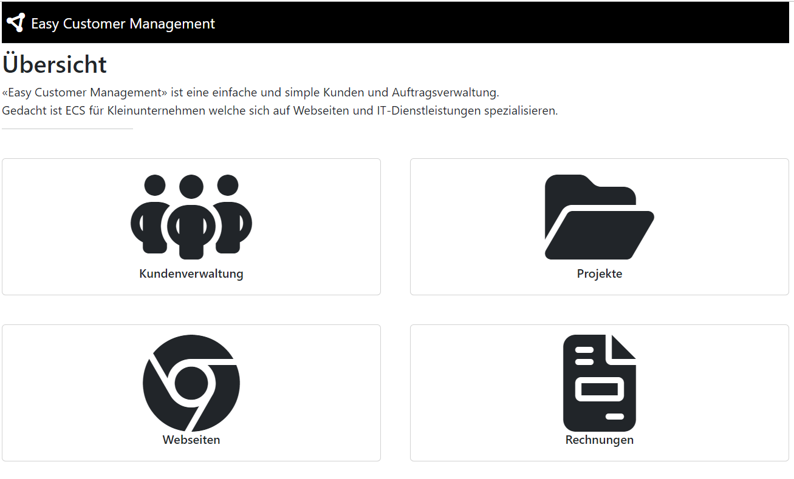

# Easy Customer Management
"Easy Customer Management" is a simple and easy customer and order management.
ECS is intended for small businesses that specialize in websites and IT services.



## Build with...

"Easy Customer Management" was created with the following frameworks:

* Codeigniter4 - https://github.com/codeigniter4/CodeIgniter4
* Shield from Codeiniter4 - https://github.com/codeigniter4/shield
* Adminator Template - https://github.com/puikinsh/Adminator-admin-dashboard


## Community

For project communication we use Elements.

https://matrix.to/#/#easy-customer-management:matrix.hi-net.ch

## Requirements

- PHP 8.0 minimum
- MariaDB or MySQL
- A webserver and subdomain (subdirectory is not supported)

## Installation

To install ECM in your production environment, connect with SSH to your server and change to your webservers (document) root directory. You need to install Git and Composer if you haven’t already.

```console
git clone https://github.com/Memurame/easy-customer-management.git
cd easy-customer-management/
```

Now install all dependencies:
```console
composer install
```

Copy the file env to .env and add the database credentials to the file.
```
database.default.hostname = localhost
database.default.database = ci4
database.default.username = root
database.default.password = root
database.default.port = 3306
```

Run the database migration:
```console
php spark ecm:install
```

## Update

**Important:** Always make a backup of your website before you make an update.

```colsole
git pull
```

Run the migration:
```console
php spark migrate --latest
```


## Cron
For ECM to work properly, a CronJob needs to be run regularly to check invoices and send email. I recommend an interval of 5 minutes.

Directly via console:
```console
/[PATH_TO_YOUR_SITE]/public/index.php cron
```

It is also possible to start the CronJob through an external service:
```
https://[YOUR_URL]/cron
``` 