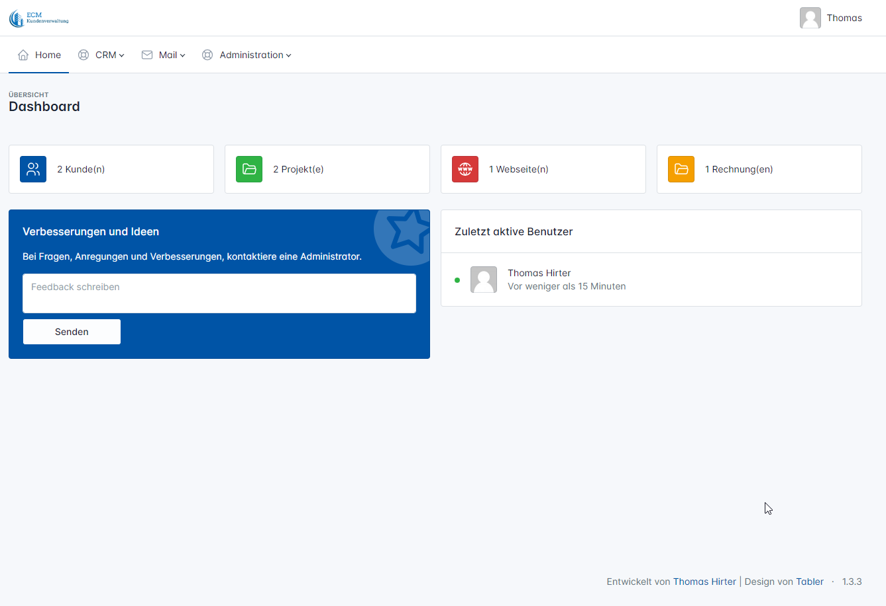

# Easy Customer Management
"Easy Customer Management" ist eine simple und einfach zu bedienende Kunden und Auftragsverwaltung.
Ich habe ECM primär für mich selbst und meine Arbeit entwickelt. 
Falls jemand interesse an diesem Projekt hat, darf er/sie es kopieren oder mithelfen bei der weiterentwicklung.

**Dieses Projekt ist vorläufig nur in Deutsch verfügbar. Wer dies gerne übersetzen möchte fühle sich frei diers zu tun.**

## Funktionen
- Kundenverwaltung
- Projekte
- Webseiten
- Rechnungen erstellen und Teilen
- Mail versenden
- Nachrichten Funktion
- Benutzerverwaltung mit detailierter Berechtigung

## Geplante Funktionen
- Zeiterfassung
- Offerten
- API




## Erstellt mit...

"Easy Customer Management" wurde mit folgenden Frameworks erstellt:

* Codeigniter4 - https://github.com/codeigniter4/CodeIgniter4
* Shield from Codeiniter4 - https://github.com/codeigniter4/shield
* Tabler Template - https://tabler.io/

## Voraussetzungen

- PHP 8.2 minimum
- Composer
- MariaDB or MySQL
- Webserver

## Installation

### Webserver
Um ECM in deiner Produktionsumgebung zu installieren, verbinde dich über SSH mit deinem Server und wechsel zum Verzeichnis deines Webservers. Du musst Git und Composer installiert haben, damit alles funktioniert.
Ersetze `[CURRENT RELEASE]` mit der letzten Release Version (https://github.com/Memurame/easy-customer-management/releases).

```console
git clone -b [CURRENT RELEASE] --depth 1 https://github.com/Memurame/easy-customer-management.git
cd easy-customer-management/
```

Composer ausführen und Abhängigkeiten installieren:
```console
composer install
```

Die Datei env nach .env kopieren und die entsprechenden Zugangsdaten eintragen.
```
database.default.hostname = localhost
database.default.database = ci4
database.default.username = root
database.default.password = root
database.default.port = 3306
```

Installation starten:
```console
php spark ecm:install
```
  
**Mögliche Parameter für die Installation**

`-q` Installation ohne Eingabe<br>
`-u` Admin Benutzername definieren (Installation ohne Eingabe)<br>
`-p` Admin Passwort definieren (Installation ohne Eingabe)<br>
`-e` E-Mail-Adresse definieren (Installation ohne Eingabe)<br>

## Update

**Important:** Erstelle immer eine Sicherungskopie deiner Website, bevor du eine Aktualisierung machst.
Ersetze `[CURRENT RELEASE]` mit der letzten Release Version (https://github.com/Memurame/easy-customer-management/releases).

```colsole
git fetch --tags
git checkout [CURRENT RELEASE]
composer install
```

Run the migration:
```console
php spark migrate --all
```


## Cron
Damit ECM richtig funktioniert, muss ein CronJob regelmäßig ausgeführt werden, um Rechnungen zu prüfen und E-Mails zu versenden. Ich empfehle ein Intervall von 5 Minuten.

Direkt in der Konsole:
```console
/[PATH_TO_YOUR_SITE]/public/index.php cron
```

Es ist auch möglich, den CronJob über einen externen Dienst zu starten:
```
https://[YOUR_URL]/cron
``` 
